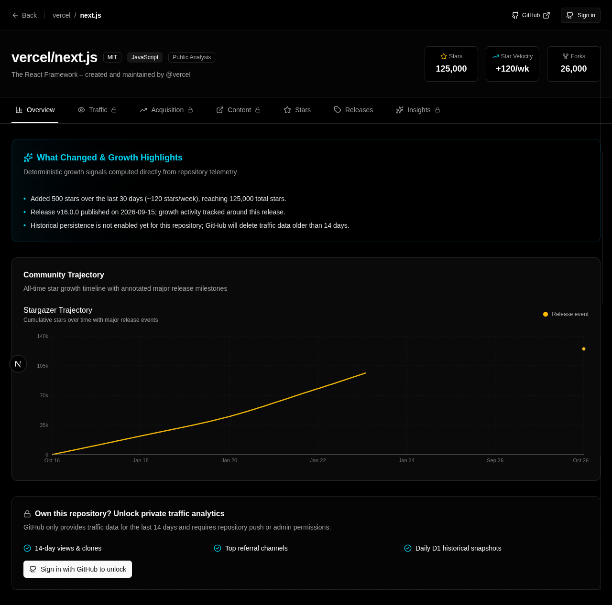
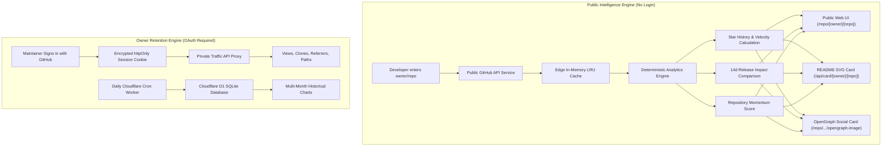

<!-- SPDX-License-Identifier: MIT -->
<div align="center">

# Understand why GitHub repositories grow.

### Explore star growth trajectory, measure release impact, compare repositories side-by-side, and preserve private traffic analytics beyond GitHub's 14-day limit.

[](https://github.com/aliammari1/github-traffic-analytics/actions/workflows/ci.yml)
[](https://codecov.io/gh/aliammari1/github-traffic-analytics)
[](LICENSE)
[](https://nextjs.org/)
[](https://pnpm.io/)

[**▶ Try Live Demo**](https://github-traffic-analytics.ali-ammari.workers.dev) · [Docs](docs/) · [Compare Repositories](https://github-traffic-analytics.ali-ammari.workers.dev/compare) · [⭐ Star this Repo](https://github.com/aliammari1/github-traffic-analytics)

<br />

<a href="https://github-traffic-analytics.ali-ammari.workers.dev">
  
</a>

</div>

---

## ⚡ Try It Instantly (No Login Required)

Analyze any public GitHub repository directly in your browser:

- [**vercel/next.js**](https://github-traffic-analytics.ali-ammari.workers.dev/repo/vercel/next.js) — Star trajectory, 7d/30d run-rate, and release impact
- [**facebook/react**](https://github-traffic-analytics.ali-ammari.workers.dev/repo/facebook/react) — Recent growth curves and milestone timeline
- [**astral-sh/ruff**](https://github-traffic-analytics.ali-ammari.workers.dev/repo/astral-sh/ruff) — Velocity acceleration and stargazer momentum
- [**Compare Trajectories**](https://github-traffic-analytics.ali-ammari.workers.dev/compare?repos=vercel/next.js,facebook/react,astral-sh/ruff) — Multi-repository side-by-side comparison

---

## 🏷️ Embed a Live Growth Card in Your README

Add a real-time, edge-cached growth card to your repository's `README.md`. It displays your repository's stars, 30-day growth, momentum score, and latest release:

```markdown
[](https://github-traffic-analytics.ali-ammari.workers.dev/repo/owner/repo)
```

### Choose a card style

Use the default metric card or add a recent star-growth sparkline:

```markdown
[](https://github-traffic-analytics.ali-ammari.workers.dev/repo/owner/repo)
```

### Choose from multiple themes

Add `?theme=<name>` to the image URL. Themes also work with `style=sparkline`:

- `github-dark` (default)
- `github-light`
- `transparent`
- `dracula`
- `nord`
- `catppuccin`

```markdown
[](https://github-traffic-analytics.ali-ammari.workers.dev/repo/owner/repo)
```

### Celebrate a real star milestone

For repositories that have crossed a supported public star threshold, the report offers a verified milestone card. The endpoint refuses milestone values the repository has not reached:

```markdown
[](https://github-traffic-analytics.ali-ammari.workers.dev/repo/owner/repo)
```

You can also embed the classic **total views badge** that counts traffic accumulated beyond GitHub's 14-day limit:

```markdown
[](https://github-traffic-analytics.ali-ammari.workers.dev/repo/you/your-repo)
```

---

## 🌟 GitHub Traffic Analytics vs Alternatives

| Feature                                  |  **GitHub Traffic Analytics**   | GitHub Built-in Insights |    Repobeats     |    star-history    |
| :--------------------------------------- | :-----------------------------: | :----------------------: | :--------------: | :----------------: |
| **Instant public analysis (no login)**   |             ✅ Yes              |  ❌ No (requires auth)   |      ❌ No       |       ✅ Yes       |
| **Star velocity & run-rate calculation** |       ✅ 7d/30d run-rate        |         ❌ None          |    ➖ Partial    | ❌ Cumulative only |
| **Release impact window analysis**       |   ✅ 14d before vs. 14d after   |         ❌ None          |     ❌ None      |      ❌ None       |
| **Multi-repository comparison**          |  ✅ Side-by-side (`/compare`)   |   ❌ Single repo only    |     ❌ None      |   ✅ Stars only    |
| **Embeddable README growth card**        |  ✅ Dynamic SVG (`/api/card`)   |         ❌ None          | ✅ Activity card |   ✅ Stars chart   |
| **Preserves traffic beyond 14 days**     |     ✅ Captured D1 history      |   ❌ 14-day API window   |  ❌ Images only  |   ❌ No traffic    |
| **Deterministic non-causal math**        | ✅ Pure TypeScript unit-tested  |         ❌ None          |     ❌ None      |      ❌ None       |
| **Contextual AI interpretation**         | ✅ Precomputed telemetry briefs |         ❌ None          |     ❌ None      |      ❌ None       |
| **100% Free & Self-Hostable**            |         ✅ MIT Licensed         |       ✅ Built-in        | ❌ SaaS pricing  |    ✅ Free tool    |

---

## 🚀 Core Features

### 1. Instant Public Repository Intelligence (`/repo/[owner]/[repo]`)

Enter any repository name or URL (`vercel/next.js`, `https://github.com/facebook/react`) to immediately inspect:

- Total stargazers & forks
- 7-day star growth & daily run-rate
- 30-day star trajectory
- Weekly velocity change percentage
- Transparent 0–100 repository momentum score

### 2. Deterministic Release Impact Timeline

Releases are mapped directly over the star trajectory chart. A windowed comparison analyzes activity **14 days before vs. 14 days after** each release with strictly non-causal temporal association language:

```text
v2.1.0
14 days before:   +520 stars (~37/day)
14 days after:    +1,840 stars (~131/day)
Star velocity:    +254%
Status:           Growth accelerated around this release.
```

### 3. Shareable Launch Reports (`/launch/[owner]/[repo]?tag=...`)

Turn a release window into a public report that compares 14 days before vs. 14 days after the release, shows star-velocity change, marks the release on the trajectory, and provides a shareable URL. The report uses non-causal language by design.

### 4. Multi-Repository Growth Comparison (`/compare`)

Compare between 2 and 4 repositories simultaneously. Trajectories are visualized side-by-side with shareable URL state (`/compare?repos=vercel/next.js,nuxt/nuxt,sveltejs/svelte`).

For two repositories, copy an embeddable comparison card directly from the Compare page:

```markdown
[](https://github-traffic-analytics.ali-ammari.workers.dev/compare?repos=vercel%2Fnext.js%2Cnuxt%2Fnuxt)
```

### 5. Long-Term Traffic Retention (Bypassing GitHub's 14-Day Limit)

GitHub's traffic API returns a recent 14-day window. After a maintainer enables tracking, a daily Cloudflare Cron Worker saves views and clones into **D1** from that point forward. It also captures GitHub's rolling top-referrer and popular-path lists, so later reports can compare observed source patterns. Retention depends on the deployment's D1 storage.

Owners can preview a deterministic weekly report, export their stored traffic as CSV or JSON, and opt into a Monday email to their verified primary GitHub address when the deployment has email delivery configured. Missing days remain unavailable rather than appearing as zero.

Installing the GitHub App and selecting repositories starts daily traffic archiving automatically. Scheduled collection then uses short-lived installation tokens scoped to those repositories; manual OAuth tracking remains available to deployments without an App.

Maintainers can also opt into weekly or monthly reports posted as a GitHub Issue or Discussion. They choose the Discussion category when applicable. On public repositories, those posts expose the included traffic counts, so this delivery is always an explicit opt-in.

Slack and Discord incoming webhook alerts can notify maintainers about observed star milestones, acceleration, slowdowns, referrer changes, and completed release windows. The webhook URL is encrypted before storage and alerts are sent only after an explicit opt-in.

Prefer a self-hosted workflow? [GitHub Traffic Analytics Lite](docs/github-action.md) is a standalone Action that archives complete traffic days as JSON and CSV to a dedicated data branch, with no hosted database.

The [public analytics API v1](docs/public-api.md) exposes compact repository growth, observed star history, release comparisons, anomalies, and multi-repository comparison for developer integrations.

### 6. Contextual AI Actions (Explains Math, Never Hallucinates)

No generic AI chatbots. Maintainers can trigger contextual briefings:

- _Explain this growth_
- _Explain this release period_
- _What changed?_
- _Summarize my traffic_

AI receives precomputed structured numbers and explains trends without calculating math.

---

## 🏛️ Architecture



---

## 💻 Quickstart (Local Development)

### Prerequisites

- Node.js 20+
- pnpm 10+ (`npm install -g pnpm`)

### Setup

```bash
# 1. Clone the repository
git clone https://github.com/aliammari1/github-traffic-analytics.git
cd github-traffic-analytics

# 2. Install dependencies
pnpm install

# 3. Configure environment
cp .env.example .env.local

# 4. Start local development server
pnpm dev
# App will be running at http://localhost:3000
```

### Environment Variables

| Variable               |              Required              | Description                                                                                                |
| :--------------------- | :--------------------------------: | :--------------------------------------------------------------------------------------------------------- |
| `NEXTAUTH_SECRET`      |                Yes                 | Session encryption secret (`openssl rand -base64 32`)                                                      |
| `NEXTAUTH_URL`         |                Yes                 | Web application URL (`http://localhost:3000` locally)                                                      |
| `GITHUB_CLIENT_ID`     |                Yes                 | GitHub OAuth App Client ID                                                                                 |
| `GITHUB_CLIENT_SECRET` |                Yes                 | GitHub OAuth App Client Secret                                                                             |
| `GITHUB_PUBLIC_TOKEN`  | Recommended for public deployments | Server-only read-only token that raises GitHub API capacity for public analysis; never sent to the browser |
| `ANTHROPIC_API_KEY`    |              Optional              | Enables contextual AI explanations (`claude-haiku-4-5`)                                                    |

> Note: Public repository intelligence works without OAuth. For a public deployment, configure `GITHUB_PUBLIC_TOKEN` so the analyzer does not rely on GitHub's small unauthenticated API quota. OAuth is only needed for owner features such as private traffic and tracking.

---

## 🚢 Deployment

### Deploy to Cloudflare Workers

The application runs on Cloudflare Workers with a D1 database:

- **Workers**: Next.js 16 via `@opennextjs/cloudflare`
- **D1 Database**: Serverless SQLite for long-term daily snapshots
- **Cron Worker**: Daily capture and hourly timezone-aware digest checks (`worker/snapshot.ts`)

Build with `pnpm cf:build`, then deploy with `pnpm exec opennextjs-cloudflare deploy`.
Create D1, set Worker secrets, and deploy the separate snapshot Worker as described
in the [deployment guide](docs/content/deployment.mdx).

Detailed step-by-step setup guides can be found in [`docs/`](docs/).

---

## 🧪 Testing & Quality Gates

```bash
pnpm lint            # ESLint CLI
pnpm typecheck       # TypeScript compilation check
pnpm test:coverage   # Vitest unit/component tests (80% minimum coverage gate)
pnpm test:e2e        # Playwright end-to-end tests (MSW-mocked)
pnpm build           # Next.js production build
```

---

## 🤝 Contributing

We welcome community contributions! Please read our [**Contributing Guide**](CONTRIBUTING.md) to understand our codebase structure, how to add new metrics, and how to create new growth card themes.

---

## 📜 License

[MIT](LICENSE) © Ali Ammari.
